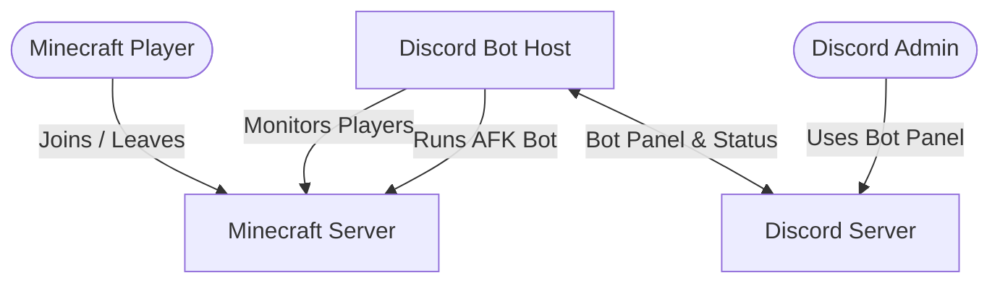

# 🚀 Deploying DiscoMine v2

This guide walks you through deploying **DiscoMine** on a Discord bot hosting service. While the steps are generally the same across most hosts, this guide uses **Quaxly Hosting** as the example.

> [!TIP]
> It is **highly recommended to complete this setup on a PC**. Uploading files, editing configuration, and managing your hosting panel is much easier on desktop.

---

# 🗺️ Overview

The diagram below shows how DiscoMine communicates with your Minecraft server and Discord server.



---

# 🛠️ Step 1 — Create Your Discord Bot

Before deploying DiscoMine, you'll need to create a Discord application and bot.

1. Visit the **Discord Developer Portal**: https://discord.com/developers/applications
2. Click **New Application**.
3. Give your application a name (for example, **DiscoMine**) and click **Create**.

## Copy your Application ID

1. Open **General Information**.
2. Copy the **Application ID**.
3. Save it as:

```
CLIENT_ID
```

## Create your Bot Token

1. Open the **Bot** tab.
2. Click **Reset Token** (or **Copy Token** if one already exists).
3. Save the token somewhere safe.

This will become:

```
DISCORD_TOKEN
```

> [!IMPORTANT]
> Never share your Discord bot token with anyone. Anyone with your token has full control of your bot.

## Enable Privileged Gateway Intents

Still under the **Bot** page, enable:

- ✅ Presence Intent
- ✅ Server Members Intent
- ✅ Message Content Intent

Click **Save Changes**.

## Invite the Bot

1. Open **OAuth2 → URL Generator**.
2. Under **Scopes**, select:
   - `bot`
3. Under **Bot Permissions**, enable:
   - Send Messages
   - Embed Links
   - Read Message History
   - Use External Emojis (optional)

Open the generated URL and invite the bot to your Discord server.

---

# 🔑 Step 2 — Get Your Discord IDs

DiscoMine needs your Discord Server ID and optionally a channel for status updates.

## Enable Developer Mode

In Discord:

**User Settings → Advanced → Developer Mode**

Enable the toggle.

## Copy your Server ID

Right-click your Discord server icon.

Select:

```
Copy Server ID
```

Save this as:

```
GUILD_ID
```

## Copy a Status Channel ID (Optional)

Right-click the channel you want DiscoMine to send status updates in.

Select:

```
Copy Channel ID
```

Save this as:

```
STATUS_CHANNEL_ID
```

---

# ⛏️ Step 3 — Prepare Your Minecraft Server

Before deploying DiscoMine, make sure your Minecraft server is configured correctly.

### Recommended Settings

- ✅ Server Software: **Paper**
- ✅ Install **ViaVersion**
- ✅ Install **ViaBackwards**
- ✅ Enable **Offline/Cracked Mode** (if your setup requires offline authentication)

These settings help ensure DiscoMine can connect successfully and remain compatible with different Minecraft versions.

---

# ☁️ Step 4 — Create a Quaxly Hosting Server

1. Go to **https://quaxly.com/**
2. Log into your panel.
3. Create a new **Node.js** server.
4. Wait until the server has finished provisioning.

Once the server is ready, continue to the next step.

---

# 📤 Step 5 — Upload DiscoMine

Open your Quaxly server.

Navigate to:

```
Files
```

Upload your project files:

```
index.js
minecraft.js
config.js
package.json
```

> [!WARNING]
> **Do NOT upload any other files**
> Only upload the files listed above. Continue with the setup after doing so.

# ⚙️ Step 6 — Upload Your .env File

Instead of manually creating environment variables, simply upload your project's:

```
.env
```

file into the root directory of your server.

Need an example?

See:

```
.env.example
```

> [!IMPORTANT]
> Before starting the bot, make sure you've updated every value inside your `.env` file with the needed information for the bot. Ensure the file is named `.env` and not `.env.txt`.

---

# ⚙️ Step 7 — Verify Startup File

Open the **Startup** tab in your Quaxly panel.

Ensure the startup file is set to:

```
index.js
```

No further changes should be required.

---

# 🚀 Step 8 — Start DiscoMine

Before starting the bot:

- ✅ Make sure your **Minecraft server is already running.**

Once your Minecraft server is online:

1. Open the **Console** page.
2. Click **Start**.

During the first startup, Quaxly will automatically install all required dependencies.

After installation completes you should see output similar to:

```text
[Discord] Logged in as ...
[Discord] slash commands removed.
[Bot] Starting bot...
```

Congratulations! 🎉

DiscoMine is now running 24/7.

---

# 🎮 Using DiscoMine

DiscoMine v2 now uses an interactive **Discord Bot Panel** instead of slash commands.

From the panel you can:

- Start the Minecraft bot
- Stop the Minecraft bot
- View connection status
- View player count
- Monitor the bot from Discord

---

# 🛠️ Troubleshooting

## Bot won't connect to Minecraft

Verify:

- Your Minecraft server is running.
- Your `.env` values are correct.
- Your server IP and port are correct.
- Offline/Cracked Mode is enabled if you're using offline authentication.
- Your server is running Paper.

---

## "Disallowed Intents"

Open the Discord Developer Portal.

Navigate to:

```
Bot
```

Enable:

- ✅ Presence Intent
- ✅ Server Members Intent
- ✅ Message Content Intent

Save your changes and restart the bot.

---

## Bot won't start

Check that:

- `index.js` is set as the startup file.
- Your `.env` file has been uploaded.
- Every value in `.env` has been updated.
- All project files were uploaded correctly.

---

# ✅ You're All Set!

Your DiscoMine bot is now fully configured and running on your preferred Discord bot hosting provider.

This guide used **Quaxly Hosting** as an example, but the same deployment process is similar on most Node.js Discord bot hosting services.
