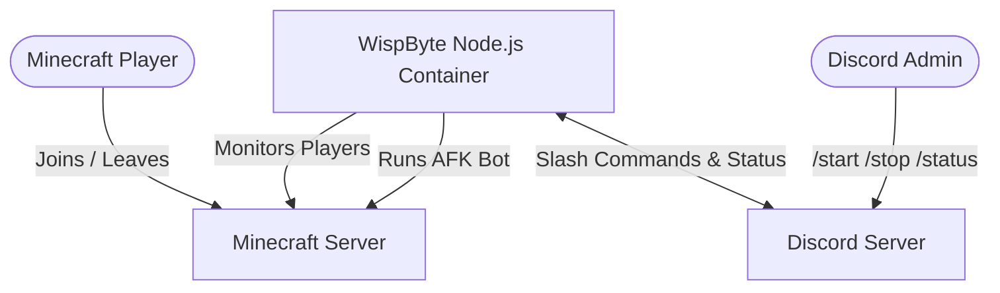

# 🚀 Deploying DiscoMine on WispByte

This guide walks you through deploying **DiscoMine** on **WispByte**, from creating your Discord bot to configuring the server and keeping it online 24/7.

---

# 🗺️ Overview

The diagram below shows how DiscoMine communicates with your Minecraft server and Discord server.



---

# 🛠️ Step 1 — Create Your Discord Bot

Before deploying DiscoMine, you'll need to create a Discord application and bot.

1. Visit the **Discord Developer Portal**: https://discord.com/developers/applications
2. Click **New Application**.
3. Give your application a name (for example, **DiscoMine**) and click **Create**.

### Copy your Application ID

1. Open **General Information**.
2. Copy the **Application ID**.
3. Save it as:

```
CLIENT_ID
```

### Create your Bot Token

1. Open the **Bot** tab.
2. Click **Reset Token** (or **Copy Token** if one already exists).
3. Save the token somewhere safe.

This will become:

```
DISCORD_TOKEN
```

> [!IMPORTANT]
> Never share your Discord bot token with anyone. Anyone with your token has full control of your bot.

### Enable Privileged Gateway Intents

Still under the **Bot** page, enable:

- ✅ Presence Intent
- ✅ Server Members Intent
- ✅ Message Content Intent

Click **Save Changes**.

These intents are required for DiscoMine to function correctly.

### Invite the Bot

1. Open **OAuth2 → URL Generator**.
2. Under **Scopes**, select:
   - `bot`
   - `applications.commands`
3. Under **Bot Permissions**, enable:
   - Send Messages
   - Use Slash Commands
   - Embed Links
   - Read Message History

Open the generated URL and invite the bot to your Discord server.

---

# 🔑 Step 2 — Get Your Discord IDs

DiscoMine needs your Discord Server ID and optionally a channel for status updates.

## Enable Developer Mode

In Discord:

**User Settings → Advanced → Developer Mode**

Enable the toggle.

## Copy your Server ID

Right-click your Discord server icon.

Select:

```
Copy Server ID
```

Save this as:

```
GUILD_ID
```

## Copy a Status Channel ID (Optional)

Choose (or create) a text channel where DiscoMine should post connection updates.

Right-click the channel.

Select:

```
Copy Channel ID
```

Save this as:

```
STATUS_CHANNEL_ID
```

---

# ☁️ Step 3 — Create a WispByte Server

1. Go to https://wispbyte.com
2. Log into the client panel.
3. Create a new server.
4. Choose the **Node.js** template.
5. Select the **Free Plan**.
6. Wait for the server to finish provisioning.

Once the server status shows **Active**, continue to the next step.

---

# 📤 Step 4 — Upload DiscoMine

Open your WispByte server.

Navigate to:

```
Files
```

Upload your project files:

```
index.js
minecraft.js
config.js
package.json
```

> [!WARNING]
> **Do NOT upload:**
>
> - `node_modules`
> - `.env`
>
> WispByte installs dependencies automatically using `package.json`, and configuration should be stored using Environment Variables.

---

# ⚙️ Step 5 — Configure Environment Variables

Open your server's **Startup** or **Environment Variables** page.

Create the following variables.

| Variable | Description | Example |
|-----------|-------------|---------|
| `DISCORD_TOKEN` | Discord bot token | `MT...` |
| `CLIENT_ID` | Discord Application ID | `123456789012345678` |
| `GUILD_ID` | Discord Server ID | `987654321098765432` |
| `MC_SERVER_IP` | Minecraft server address | `play.example.net` |
| `MC_SERVER_PORT` | Minecraft port | `25565` |
| `MC_USERNAME` | Bot username | `DiscoMineAFK` |
| `MC_AUTH` | `offline` or `microsoft` | `offline` |
| `STATUS_CHANNEL_ID` | Optional Discord channel | `112233445566778899` |

Finally, verify your startup command is:

```bash
node index.js
```

or

```bash
npm start
```

---

# 🚀 Step 6 — Start the Bot

Return to the **Console** page.

Click **Start**.

During the first startup WispByte will automatically install all required dependencies.

After installation completes you should see output similar to:

```text
[Discord] Logged in as ...
[Discord] Slash commands registered!
[Bot] Starting bot...
```

Congratulations! 🎉

DiscoMine is now running 24/7.

---

# 🎮 Slash Commands

### `/start`

Starts the Minecraft bot.

If the server is empty, the bot remains connected as an AFK player.

If players join, the bot disconnects automatically.

---

### `/stop`

Immediately disconnects the Minecraft bot.

---

### `/status`

Displays:

- Connection status
- Player count
- Bot uptime
- Reconnect count

---

# 🛠️ Troubleshooting

## Slash commands aren't appearing

Make sure the bot was invited using both OAuth scopes:

- `bot`
- `applications.commands`

If necessary:

1. Remove the bot from your Discord server.
2. Generate a new invite link.
3. Invite the bot again.

---

## Minecraft connection timed out

Verify:

- `MC_SERVER_IP`
- `MC_SERVER_PORT`

If your Minecraft server uses sleep mode, the first connection attempt may fail while the server starts.

DiscoMine will automatically retry until the server becomes available.

---

## "Disallowed Intents"

Open the Discord Developer Portal.

Navigate to:

```
Bot
```

Enable:

- ✅ Presence Intent
- ✅ Server Members Intent
- ✅ Message Content Intent

Click **Save Changes**, then restart the bot.

---

# ✅ You're All Set!

Your DiscoMine bot is now fully configured and running on WispByte.

If you encounter any issues, double-check your environment variables, Discord bot configuration, and Minecraft server details before seeking support.
