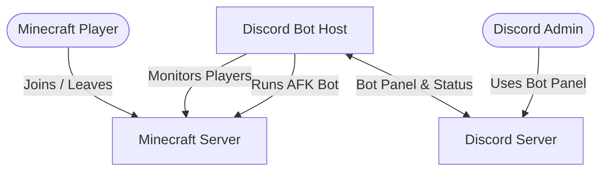

# 🚀 Deploying DiscoMine v2

This guide walks you through deploying **DiscoMine** on a Discord bot hosting service. While the steps are generally the same across most hosts, this guide uses **Quaxly Hosting** as the example.

> [!TIP]
> It is **highly recommended to complete this setup on a PC**. Downloading files, uploading your project, editing configuration files, and managing your hosting panel are much easier on desktop.

---

# 🗺️ Overview

The diagram below shows how DiscoMine communicates with your Minecraft server and Discord server.


```mermaid
graph TD
    User([Minecraft Player]) -->|Joins / Leaves| Server[Minecraft Server]
    Host[Discord Bot Host] -->|Monitors Players| Server
    Host -->|Runs AFK Bot| Server
    Host <-->|Bot Panel & Status| Discord[Discord Server]
    Admin([Discord Admin]) -->|Uses Bot Panel| Discord
```

---

# 📥 Step 1 — Download DiscoMine

Before you begin, download the DiscoMine project from this GitHub repository.

1. Open this GitHub repository.
2. Click the green **Code** button.
3. Select **Download ZIP**.
4. Once the download is complete, extract the ZIP file to a folder on your computer.

> [!TIP]
> Keep the extracted folder somewhere easy to find—you'll upload these files to your hosting provider later.

---

# 🛠️ Step 2 — Create Your Discord Bot

Before deploying DiscoMine, you'll need to create a Discord application and bot.

1. Visit the **Discord Developer Portal**: https://discord.com/developers/applications
2. Click **New Application**.
3. Give your application a name (for example, **DiscoMine**) and click **Create**.

## Copy your Application ID

1. Open **General Information**.
2. Copy the **Application ID**.
3. Save it as:

```text
CLIENT_ID
```

## Create your Bot Token

1. Open the **Bot** tab.
2. Click **Reset Token** (or **Copy Token** if one already exists).
3. Save the token somewhere safe.

This will become:

```text
DISCORD_TOKEN
```

> [!IMPORTANT]
> Never share your Discord bot token with anyone. Anyone with your token has full control of your bot.

## Enable Privileged Gateway Intents

Still under the **Bot** page, enable:

* ✅ Presence Intent
* ✅ Server Members Intent
* ✅ Message Content Intent

Click **Save Changes**.

## Invite the Bot

1. Open **OAuth2 → URL Generator**.
2. Under **Scopes**, select:

   * `bot`
3. Under **Bot Permissions**, enable:

   * Send Messages
   * Embed Links
   * Read Message History
   * Use External Emojis (optional)

Open the generated URL and invite the bot to your Discord server.

---

# 🔑 Step 3 — Get Your Discord IDs

DiscoMine needs your Discord Server ID and a channel for panel updates.

## Enable Developer Mode

In Discord:

**User Settings → Advanced → Developer Mode**

Enable the toggle.

## Copy your Server ID

Right-click your Discord server icon.

Select:

```text
Copy Server ID
```

Save this as:

```text
GUILD_ID
```

## Copy a Channel ID

Right-click the channel where you want DiscoMine to post updates.

Select:

```text
Copy Channel ID
```

Save this as:

```text
STATUS_CHANNEL_ID
```

---

# ⛏️ Step 4 — Prepare Your Minecraft Server

Before deploying DiscoMine, make sure your Minecraft server is configured correctly.

## Recommended Settings

* ✅ Server Software: **Paper** (for plugins)
* ✅ Install the **ViaVersion** plugin
* ✅ Install the **ViaBackwards** plugin
* ✅ Enable **Offline/Cracked Mode** in server settings (if your setup requires offline authentication)

These settings help ensure DiscoMine can connect successfully and remain compatible with different Minecraft versions.

---

# ☁️ Step 5 — Create a Quaxly Hosting Server

1. Go to **[https://quaxly.com/](https://quaxly.com/)**
2. Log into your hosting panel.
3. Create a new **Node.js** server.
4. Leave the default server settings unless you have a reason to change them.
5. Wait until the installation has completed.

Once your server is ready, continue to the next step.

---

# 📤 Step 6 — Upload the Project Files

Open your Quaxly server.

Navigate to:

```text
Files
```

Upload the following files:

```text
index.js
panel.js
config.js
minecraft.js
package.json
```

---

# ⚙️ Step 7 — Configure Your `.env` File

The project already includes a `.env` file.

Open the `.env` file with any text editor and replace each placeholder value with your own Discord and Minecraft information.

After editing the file, upload it to your server as well.

> [!IMPORTANT]
> Before starting the bot, make sure **every value** inside your `.env` file has been updated. Ensure the file is named `.env` and **not** `.env.txt` or anything similar.

---

# 🚀 Step 8 — Start DiscoMine

Before starting the bot:

* ✅ Make sure your **Minecraft server is already running**.

Once your Minecraft server is online:

1. Open the **Console** page.
2. Click **Start**.

The first startup may take a few minutes while Quaxly automatically installs all required Node.js dependencies from `package.json`.

Future startups will be much faster.

After installation completes, you should see output similar to:

```text
[Discord] Logged in as ...
[Discord] slash commands removed.
[Bot] Starting bot...
```

Congratulations! 🎉

DiscoMine is now running 24/7.

---

# 🎮 Using DiscoMine

DiscoMine v2 is controlled through an interactive Discord panel instead of slash commands.

From the panel you can:

* ▶️ Start the Minecraft bot
* ⏹️ Stop the Minecraft bot
* 📊 View the bot's connection status
* 👥 Monitor the current player count

---

# 🛠️ Troubleshooting

## Bot won't connect to Minecraft

Verify that:

* Your Minecraft server is running.
* Your `.env` values are correct.
* Your server IP and port are correct.
* Offline/Cracked Mode is enabled if you're using offline authentication.
* Your server is running Paper.

---

## "Disallowed Intents"

Open the Discord Developer Portal.

Navigate to:

```text
Bot
```

Enable:

* ✅ Presence Intent
* ✅ Server Members Intent
* ✅ Message Content Intent

Click **Save Changes**, then restart your bot.

---

## Bot won't start

Check that:

* `index.js` is set as the startup file.
* Your `.env` file has been uploaded.
* Every value inside `.env` has been updated.
* All project files were uploaded successfully.

---

# ✅ You're All Set!

Your DiscoMine bot is now configured and running.

Although this guide uses **Quaxly Hosting** as an example, the same deployment process works for most Node.js Discord bot hosting providers.

Enjoy using DiscoMine! 🎉
